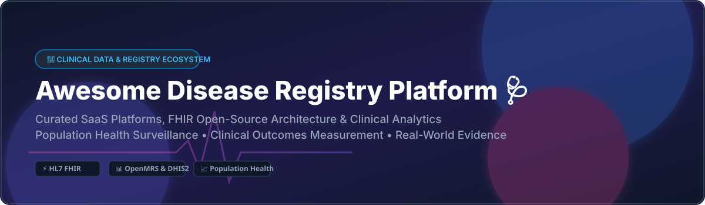

<p align="center">
  
</p>

# 🩺 Awesome Disease Registry Platform & Infrastructure

[](https://awesome.re)
[](https://opensource.org/licenses/MIT)
[](https://hl7.org/fhir/)
[](README.md#handshake-how-to-contribute)

## 🌐 Top Clinical Disease Registry & Population Health Platform Ecosystem

> **Curated List of Enterprise SaaS Platforms & Open-Source Clinical Registry Software**  
> *Focused on Clinical Data Registries, Chronic Condition Tracking, Real-World Evidence (RWE), Population Health Surveillance, Quality Outcomes Measurement & Specialty Data Collection*  
> **Last updated: September 2026**

Welcome to the definitive guide on **Disease Registry Systems**, **Clinical Data Registries (CDR)**, and **Population Health Management (PHM)** technology stacks. These platforms collect, aggregate, and analyze structured clinical data across patient cohorts to accelerate clinical research, ensure MIPS/MACRA quality compliance, enable post-market surveillance, and optimize value-based care outcomes.

---

## 📑 Table of Contents
- [📊 Market Overview & Industry Insights](#-market-overview--industry-insights)
- [🏢 SaaS & Enterprise Clinical Data Platforms](#-saas--enterprise-clinical-data-platforms)
- [🔓 Open-Source Repositories & Toolkits](#-open-source-repositories--toolkits)
- [🏗️ Architectural Frameworks](#-architectural-frameworks-for-custom-registries)
- [🤝 How to Contribute](#-how-to-contribute)
- [⚠️ Disclaimer](#%EF%B8%8F-disclaimer)

---

## 📊 Market Overview & Industry Insights

> 💡 **Market Size & Fragmentation Analysis:**  
> The global **Patient Registry & Clinical Data Software Market** is estimated at **$2.5 Billion** (2025/2026) and is projected to reach **$5.8 Billion by 2030** at a CAGR of ~13.5%. The market is **moderately fragmented**: mega EMR vendors (such as *Oracle Health* and *Epic Systems*) hold high market concentration for hospital network registries, while specialized clinical research, specialty-society registries, and quality data aggregation remain fragmented across focused domain software providers like *FIGmd (MRO)*, *Health Catalyst*, and *Arcadia*.

---

## 🏢 SaaS & Enterprise Clinical Data Platforms

The table below outlines leading enterprise SaaS platforms powering clinical condition tracking, population analytics, and specialty registries.

| 🏢 Platform / Vendor | 📊 Enterprise Size (Valuation / Revenue) | 💵 Specific Starting Pricing Tier | 🎁 Free Tier / Trial Limit | 🎯 Core Focus & Registry Capabilities |
| :--- | :--- | :--- | :--- | :--- |
| **[Oracle Population Health](https://www.oracle.com/health/)** | **$300B+ Market Cap** (Parent: Oracle) | $15,000 / month / enterprise node | 30-day enterprise evaluation sandbox | EHR-embedded enterprise population health, EHR disease registries, and global health data network. |
| **[Epic Healthy Planet](https://www.epic.com/)** | **$4.6B+ Annual Revenue** (Private) | $250,000 initial license fee | 14-day guided vendor sandbox demonstration | EHR-native population health module used by major health systems for care management & quality registries. |
| **[Premier PINC AI](https://www.pinc-ai.com/)** | **$2.4B Market Cap** (NASDAQ: PINC) | $3,500 / month / hospital facility | 30-day clinical analytics trial portal | Clinical intelligence, quality measure engines, and real-world data (RWD) registries across US hospitals. |
| **[Health Catalyst](https://www.healthcatalyst.com/)** | **$450M+ Market Cap** (NASDAQ: HCAT) | $5,000 / month / organizational tier | 30-day trial environment for DOS data platform | Data operating system (DOS) powering registry abstraction, quality measures, and analytics. |
| **[Arcadia](https://www.arcadia.io/)** | **$150M+ Est. Annual Revenue** (Private) | $2,500 / month / clinic network tier | 14-day interactive platform demo sandbox | Population health data platform providing risk stratification, ACO registries, and care gap tracking. |
| **[MedeAnalytics](https://medeanalytics.com/)** | **$100M+ Est. Annual Revenue** (Private) | $2,000 / month / facility tier | 30-day guided trial access | Healthcare analytics platform for population health registries, financial outcome tracking, and payer integration. |
| **[FIGmd (MRO)](https://www.figmd.com/)** | **$80M+ Est. Revenue** (Acquired by MRO) | $1,500 / month / registry module | 14-day specialty registry trial sandbox | Specialty society clinical data registries, automated data extraction, and MIPS quality reporting. |
| **[Azara DRVS](https://www.azarahealthcare.com/)** | **$40M+ Est. Revenue** (Private) | $800 / month / clinic tier | 30-day trial for Community Health Centers | Data Reporting & Visualization System (DRVS) tailored for FQHCs, community health, and quality reporting. |
| **[MDLand](https://www.mdland.com/)** | **$25M+ Est. Revenue** (Private) | $450 / month / practice provider | 14-day practice management & registry trial | Ambulatory EHR & registry tools focused on urban clinics, disease surveillance, and quality measures. |

---

## 🔓 Open-Source Repositories & Toolkits

Open-source solutions power global health surveillance, research registries, and standards-compliant HL7 FHIR infrastructure. 

*(Sorted by GitHub Star count descending)*

- **[synthetichealth/synthea](https://github.com/synthetichealth/synthea/stargazers)** [](https://github.com/synthetichealth/synthea/stargazers)  
  💉 Synthetic patient population generator that simulates realistic medical histories and disease registry cohorts.

- **[hapifhir/hapi-fhir](https://github.com/hapifhir/hapi-fhir/stargazers)** [](https://github.com/hapifhir/hapi-fhir/stargazers)  
  🔥 Complete HL7 FHIR specification implementation in Java, serving as the foundational backend for modern condition-specific registries.

- **[openmrs/openmrs-core](https://github.com/openmrs/openmrs-core/stargazers)** [](https://github.com/openmrs/openmrs-core/stargazers)  
  🏥 Premier open-source electronic medical record platform, highly configurable for longitudinal disease programs (HIV, TB, NCDs).

- **[OHDSI/CommonDataModel](https://github.com/OHDSI/CommonDataModel/stargazers)** [](https://github.com/OHDSI/CommonDataModel/stargazers)  
  🔬 OMOP Common Data Model specification for converting disparate disease registries into standardized observational health databases.

- **[cBioPortal/cbioportal](https://github.com/cBioPortal/cbioportal/stargazers)** [](https://github.com/cBioPortal/cbioportal/stargazers)  
  🧬 Open-source cancer genomics & clinical disease registry visualization platform created by MSKCC.

- **[dhis2/dhis2-core](https://github.com/dhis2/dhis2-core/stargazers)** [](https://github.com/dhis2/dhis2-core/stargazers)  
  🌍 Deployed globally across 70+ countries for national disease surveillance, tracker registries, and public health monitoring.

- **[bahmni/openmrs-module-bahmniapps](https://github.com/bahmni/openmrs-module-bahmniapps/stargazers)** [](https://github.com/bahmni/openmrs-module-bahmniapps/stargazers)  
  🩺 Integrated EMR and hospital information system tailored for low-resource disease registries and clinical management.

- **[OpenSRP/opensrp-client-core](https://github.com/OpenSRP/opensrp-client-core/stargazers)** [](https://github.com/OpenSRP/opensrp-client-core/stargazers)  
  📱 FHIR-native mobile digital health platform for frontline health workers, managing offline electronic immunization and disease registers.

- **[intrahealth/gofr](https://github.com/intrahealth/gofr/stargazers)** [](https://github.com/intrahealth/gofr/stargazers)  
  🏛️ Global Open Facility Registry built on FHIR/mCSD to provide master facility data for disease registries.

---

## 🏗️ Architectural Frameworks for Custom Registries

When designing a production-grade, open-standards disease registry infrastructure:

```
┌─────────────────┐      ┌──────────────────┐      ┌──────────────────┐
│   Data Capture  │ ───► │  Interoperability│ ───► │ Analytics & BI   │
│ (OpenMRS / SRP) │      │   (HAPI FHIR)    │      │ (DHIS2 / Metabase)│
└─────────────────┘      └──────────────────┘      └──────────────────┘
```

1. **Frontline Capture**: Deploy **OpenMRS** or **OpenSRP** for clinical workflows and offline-capable registries.
2. **Standardization Engine**: Utilize **HAPI FHIR** or **OMOP CDM** to structure health data for research.
3. **Surveillance & BI**: Aggregate data into **DHIS2** or **Apache Superset / Metabase** for population dashboards.

---

## 🤝 How to Contribute

Contributions are warmly welcome! 💖

1. 🍴 **Fork** the repository.
2. 📝 **Add/Update** entries in `README.md` following the table or list schema.
3. 🔎 **Provide** accurate details (include repository links, vendor metrics, or software capabilities).
4. 🚀 **Open a Pull Request** with a clear explanation of changes.

---

## ⚠️ Disclaimer

- This is a **community-curated list** provided for educational and informational purposes.
- Disease registry systems handle protected health information (PHI) and must comply with **HIPAA**, **GDPR**, and relevant data governance standards.
- Inclusion of commercial or open-source software does not constitute an endorsement.

---

<p align="center">
  <b>Built with ❤️ for Clinical Registry Teams, Epidemiologists & Health IT Innovators Worldwide</b>
</p>
